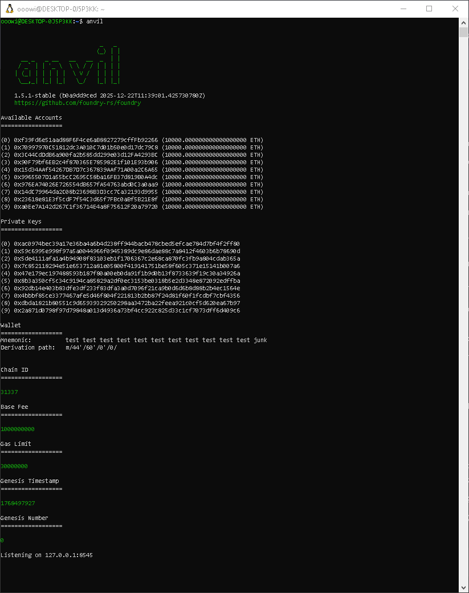
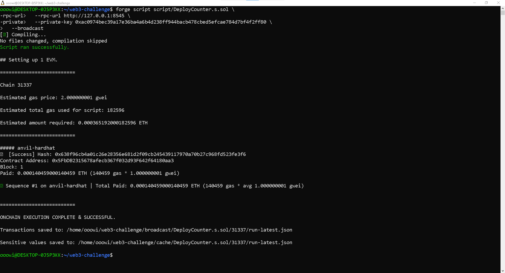
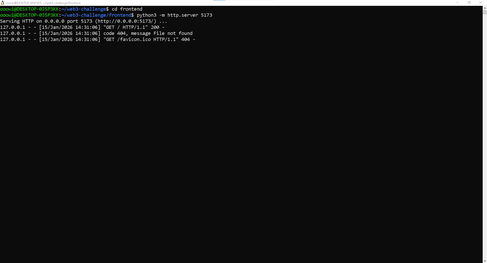
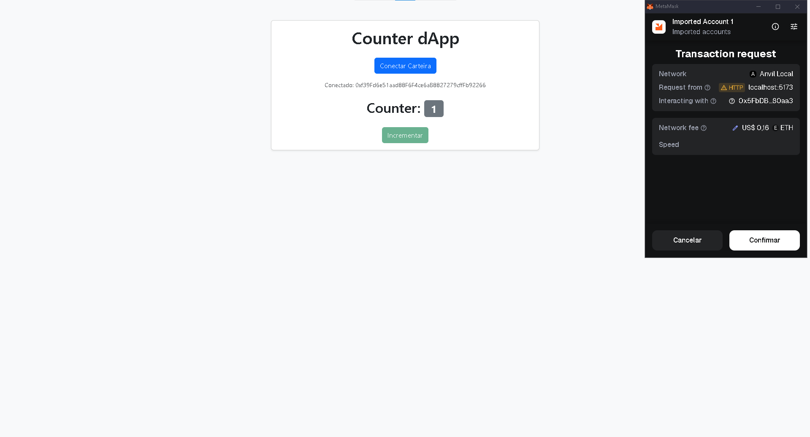

# Web3 Counter dApp

Simple Web3 dApp built with Solidity, Foundry (Anvil) and Ethers.js.

The application allows a user to connect a wallet (MetaMask) and increment a counter stored on a smart contract deployed on a local blockchain.

---

## Tech Stack

- Solidity  
- Foundry (Forge + Anvil)  
- Ethers.js v6  
- MetaMask  
- Bootstrap 5  
- Python HTTP Server  

---

## Smart Contract

The contract stores a single `uint256` counter and exposes:

- `counter()` — returns the current value  
- `increment()` — increments the counter by 1  

The contract is deployed locally using **Anvil** (chainId `31337`).

---

## How to Run Locally

### 1. Start local blockchain

```bash
anvil

```


### 2. Deploy the contract

```bash
forge script script/DeployCounter.s.sol \
  --rpc-url http://127.0.0.1:8545 \
  --private-key <ANVIL_PRIVATE_KEY> \
  --broadcast

```



After deployment, copy the generated contract address and update it in:
frontend/index.html

### 3. Start frontend

```bash
cd frontend
python3 -m http.server 5173

```



Open in the browser:
http://localhost:5173



---

## Usage

- Connect MetaMask (Anvil network)
- Click Increment
- Confirm the transaction
- Counter value updates after confirmation 

---

## Notes

- Uses Anvil default test accounts
- No real ETH involved
- Project intended for technical assessment purposes


